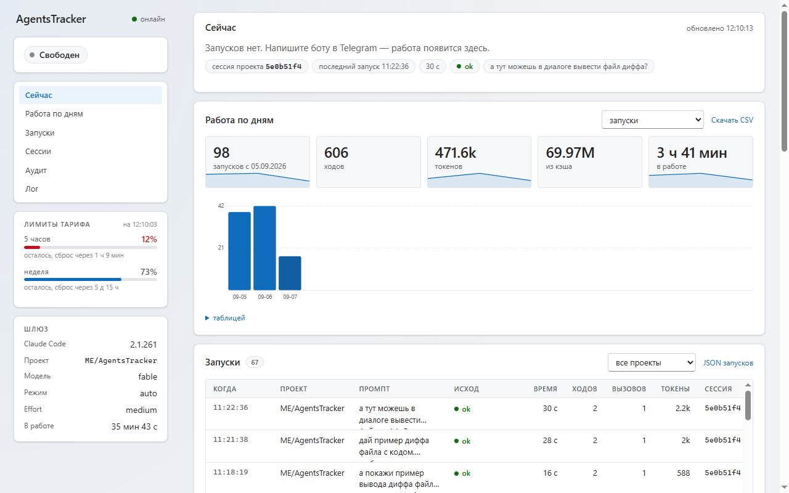

<h1 align="center">AgentsTracker</h1>

<p align="center">
  Telegram-бот, через который вы ставите задачи Claude Code на своём компьютере.<br>
  Пишете боту — на ПК запускается <code>claude</code> в папке проекта — ответ приходит в чат.
</p>

<p align="center">
  
  
  
  
</p>

<!-- Скриншоты Telegram: положите в docs/images/ и раскомментируйте.
     telegram-approval.png — карточка 🔐 с кнопками; telegram-answer.png — ответ агента.
<p align="center">
  
  &nbsp;&nbsp;
  
</p>
-->

Каждое опасное действие агент подтверждает у вас кнопкой. Разговор не теряется между
сообщениями и перезапусками. Компьютер должен быть включён, белый IP не нужен.

## Как это выглядит

**Задача — обычным сообщением:**

> **Вы:** поправь падение при пустом списке в `OrdersService` и прогони тесты
>
> **Бот:** 🕐 Работаю… 0:42 · 🧵 5e0b51f4
> 🔧 3 вызова
> ▸ Читаю OrdersService.cs
> ▸ Правлю OrdersService.cs
>
> **Бот:** 🔐 **Bash** — прогнать тесты
> `dotnet test --nologo`
> `[ ✅ Разрешить ]  [ ♾ Всегда ]  [ ❌ Отклонить ]  [ ✋ Отклонить с причиной ]`
>
> **Бот:** Причина — `First()` на пустой коллекции. Заменил на `FirstOrDefault` с проверкой,
> тесты зелёные: 42 passed.

**Переключение из чата:**

> `/project` → выбрать репозиторий кнопками
> `/model opus` · `/effort high` · `/mode plan`
> `/status` → что делает агент сейчас и сколько осталось по тарифу

**Веб-монитор** на этом же ПК (<http://127.0.0.1:5100/>): текущая задача, очередь,
история, статистика, аудит и лог.

<p align="center">
  
</p>

## Быстрый старт

### Что нужно

| | Проверка | Если нет |
|---|---|---|
| Windows 10/11 | — | другие ОС не поддерживаются |
| .NET 10 SDK | `dotnet --list-sdks` → строка `10.x` | [скачать SDK](https://dotnet.microsoft.com/download/dotnet/10.0) (не Runtime) |
| PowerShell 7 | `pwsh --version` | `winget install Microsoft.PowerShell` |
| Claude Code | `claude --version` | `irm https://claude.ai/install.ps1 \| iex`, открыть новое окно |
| Вход в Claude | `claude` стартует без просьбы войти | запустить `claude` и войти по подписке |
| Telegram доступен | `curl.exe -sI https://api.telegram.org` | указать `Proxy` в настройках |

Node.js не нужен. Git — по желанию: меню проектов ищет папки с `.git`.

### Пять шагов

1. **Бот.** У [@BotFather](https://t.me/BotFather) команда `/newbot`, скопируйте токен.
2. **Настройки.** Скопируйте `src/AgentsTracker.Gateway/appsettings.Local.example.json`
   рядом как `appsettings.Local.json`, впишите `BotToken` и `ProjectPath`.
3. **Запуск:**
   ```powershell
   dotnet run --project src\AgentsTracker.Gateway
   ```
4. **Ваш id.** Напишите боту что угодно — в консоли появится
   `Отклонено сообщение от постороннего пользователя. user id: 123456789`.
   Впишите номер в `"AllowedUserIds": [ 123456789 ]`.
5. **Перезапустите** той же командой. Бот напишет «🔌 Шлюз запущен».

Это запуск «попробовать». Для постоянной работы — следующий раздел.

## Постоянная установка

Один скрипт публикует приложение в `Release`, убирает секреты из папки публикации, шифрует
токен, переносит настройки в `%LOCALAPPDATA%\AgentsTracker\` и заводит задачу Планировщика,
которая поднимает шлюз при входе в Windows:

```powershell
pwsh -File scripts\install-autostart.ps1 -InstallDir C:\Apps\AgentsTracker
```

| Параметр | Зачем |
|---|---|
| `-InstallDir <путь>` | папка установки. Возьмите её вне репозитория, иначе `git clean` снесёт установку |
| `-SelfContained` | публиковать вместе со средой выполнения: на машине не нужен .NET |
| `-SkipPublish` | установить готовую публикацию, принесённую с другой машины: исходники и SDK не нужны |
| `-Uninstall` | снять задачу; папку установки и данные не трогает |

Обновление — тот же скрипт: он сам остановит шлюз, опубликует новую версию и перерегистрирует
задачу. Конфиг, сессии и аудит живут отдельно, в папке данных, и не затрагиваются.

Порты меняются только ключами `McpPort` и `MonitorPort` в конфиге (`--urls` и
`ASPNETCORE_URLS` не действуют), оба слушают только `127.0.0.1`.

Подробно — [docs/deployment.md](docs/deployment.md): секреты и DPAPI, слои конфига, проверка
после установки, резервная копия, где смотреть лог, несколько экземпляров.

## Команды

| Команда | Что делает |
|---|---|
| любой текст | задача агенту |
| `/menu` | все настройки кнопками |
| `/status` · `/usage` | что происходит сейчас · остаток тарифа |
| `/new` · `/stop` | начать разговор заново · прервать задачу |
| `/sessions` | сессии проекта: переключить, новая, остановить |
| `/agent` | модель, effort, режим разрешений (или `/model`, `/effort`, `/mode` текстом) |
| `/project` | сменить папку проекта |
| `/skills` | скиллы и плагины Claude Code |
| `/rules` | правила «Всегда» этого репозитория; `/rules clear` — снять |
| `/audit` · `/help` | последние действия · справка |

## Подробнее

<details>
<summary><b>Перезапуск</b></summary>

Настройки читаются один раз при старте: поправили `appsettings.Local.json` — перезапустите.

Запускали вручную:

```powershell
Get-Process AgentsTracker.Gateway | Stop-Process -Force
dotnet build src\AgentsTracker.Gateway
Start-Process src\AgentsTracker.Gateway\bin\Debug\net10.0\AgentsTracker.Gateway.exe
```

Настроен автозапуск:

```powershell
Stop-ScheduledTask -TaskName 'AgentsTracker Gateway'
Start-ScheduledTask -TaskName 'AgentsTracker Gateway'
```

Если перезапуск пришёлся на работающую задачу, бот предупредит. Сделанное сохранено,
напишите «продолжай».

</details>

<details>
<summary><b>Основные настройки</b></summary>

Файл `appsettings.Local.json`, секция `Gateway`:

| Ключ | Зачем |
|---|---|
| `BotToken` | токен от @BotFather |
| `AllowedUserIds` | кому можно управлять ботом |
| `ProjectPath` | папка проекта по умолчанию |
| `Projects` / `ProjectsRoot` | какие папки показывать в меню выбора проекта |
| `Agent` | какой агент за шлюзом; пока только `claude` |
| `Claude:Executable` | путь к `claude.exe`, если автопоиск не нашёл |
| `Claude:BuiltInSkills` | встроенные скиллы для `/skills`, строки `"/команда \| описание \| подсказка аргументов"` |
| `Model`, `Effort` | модель и глубина размышлений по умолчанию |
| `PermissionMode` | что можно без спроса: `default`, `acceptEdits`, `auto`, `plan` |
| `Proxy` | прокси, если Telegram недоступен напрямую |
| `MonitorPort` | порт веб-монитора (5100), `0` — выключить |
| `McpPort` | порт, по которому `claude` спрашивает разрешения у бота (5099) |
| `ApprovalTimeoutMinutes`, `RunTimeoutMinutes` | сколько ждать ответа на карточку (15) и всю задачу (60) |

Полный список — в `appsettings.json`.

</details>

<details>
<summary><b>Безопасность</b></summary>

Бот даёт доступ к командной строке вашего ПК. Поэтому:

- **обязательно** заполните `AllowedUserIds` — это единственная защита от посторонних;
- групповые чаты бот игнорирует, только личные;
- токен бота хранится зашифрованным (DPAPI): расшифрует только ваша учётная запись на этой
  машине;
- порт для `claude` открыт только внутри ПК (`127.0.0.1`) и закрыт секретным токеном;
- веб-монитор тоже только на `127.0.0.1`, но без пароля: его видит любой, кто вошёл на этот
  ПК. Он только показывает и ничего не меняет; не нужен — `"MonitorPort": 0`;
- отключить подтверждения из чата нельзя — только правкой файла на самой машине;
- запретить что-то намертво можно в `.claude/settings.local.json` проекта:

  ```json
  { "permissions": { "deny": ["Bash(rm *)"] } }
  ```

  Кнопка «Всегда» такие запреты не обходит;
- правила «Всегда» привязаны к репозиторию: разрешённое в одном не действует в другом;
- «Плагины» в `/skills` правят ваш `~/.claude/settings.json` — то же, что `/plugin` в самом
  Claude Code;
- если команда или правка не влезла в карточку, перед ней приходит файл с полным текстом —
  не разрешайте, не заглянув.

</details>

<details>
<summary><b>Если что-то не так</b></summary>

| Симптом | Причина |
|---|---|
| `dotnet` не найден или «SDK 10.0 не установлен» | нет .NET 10 SDK — см. «Что нужно» |
| Бот молчит | не заполнен `AllowedUserIds`, неверный токен или Telegram недоступен без прокси |
| Правка настроек не подействовала | нужен перезапуск |
| В меню не все репозитории | не задан `ProjectsRoot`; список листается `◀ ▶` |
| `claude` не найден | не поставлен CLI или не открыто новое окно PowerShell; крайний случай — `Claude:Executable` |
| Агент просит войти в аккаунт | запустите `claude` в PowerShell и войдите; бот использует этот вход |
| Сборка падает с `MSB3021` | шлюз запущен — `Get-Process AgentsTracker.Gateway \| Stop-Process` |
| Кнопки не приходят | `PermissionMode` стоит `auto` — поставьте `default` |
| В логе кракозябры | консоль в cp866; смотрите лог в PowerShell |

</details>

---

Устройство проекта — [CLAUDE.md](CLAUDE.md), детали эксплуатации, контракта с CLI и
монитора — [docs/](docs/).
