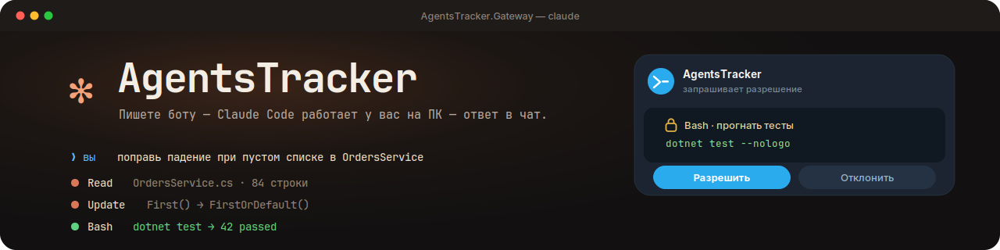
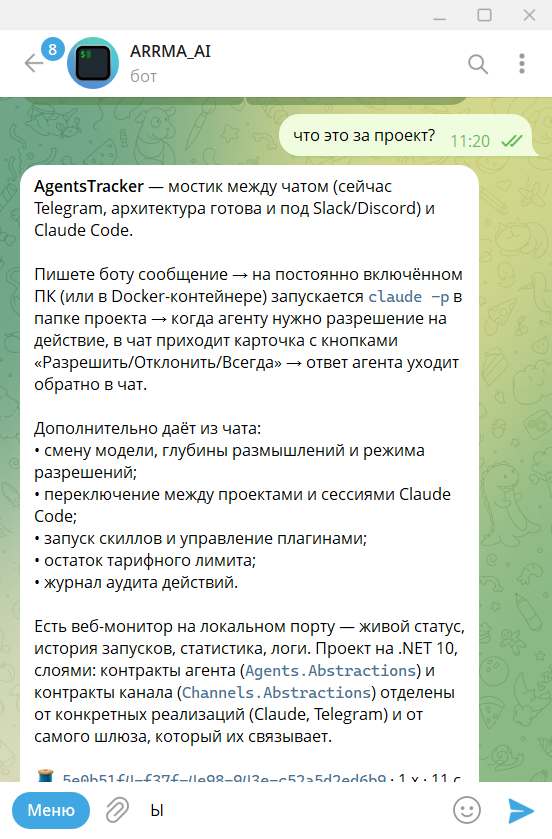
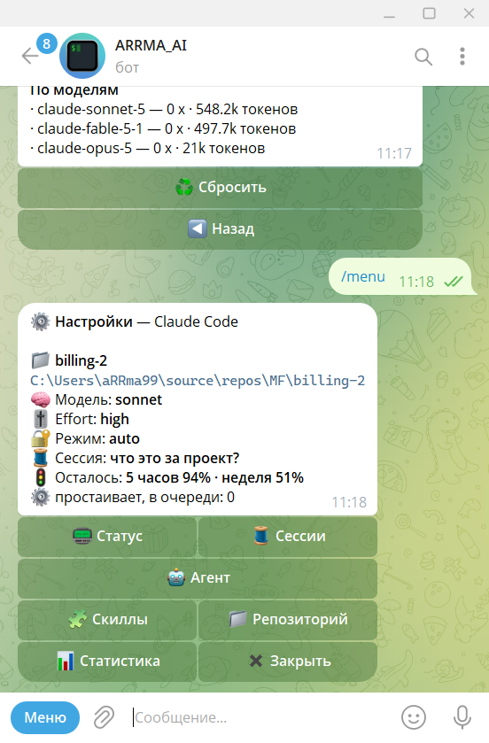
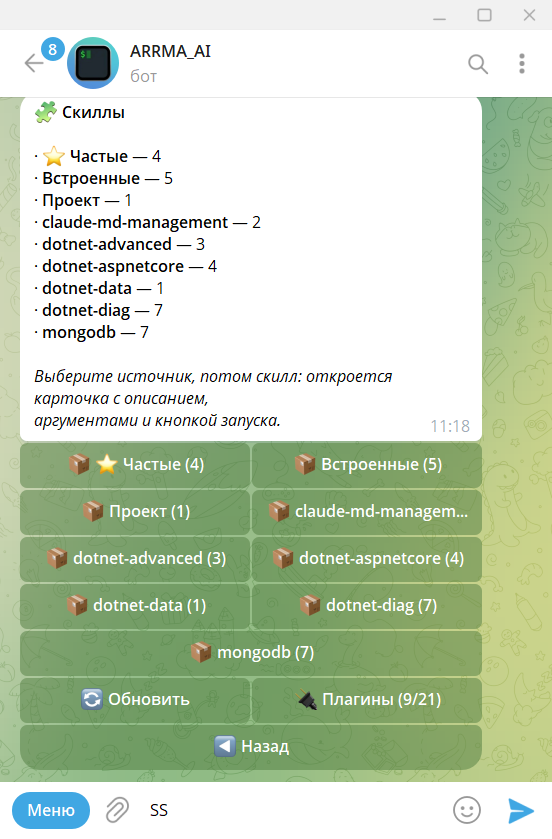
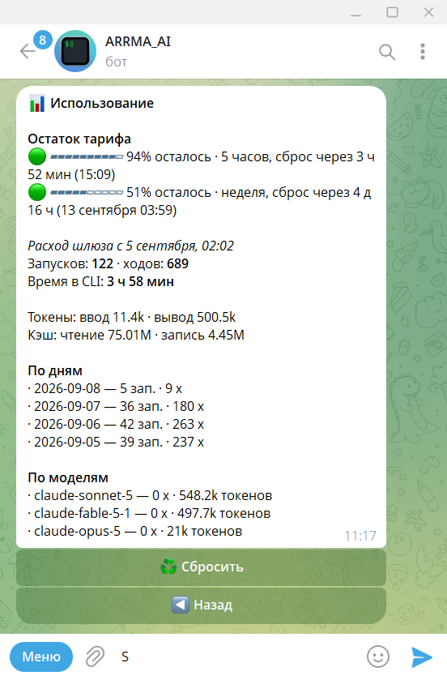
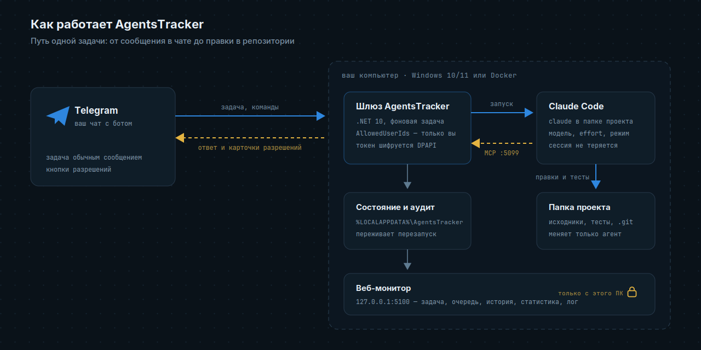

<h1 align="center">AgentsTracker</h1>

<p align="center">
  
</p>

<p align="center">
  Telegram-бот, через который вы ставите задачи Claude Code на своём компьютере.<br>
  Пишете боту — на ПК запускается <code>claude</code> в папке проекта — ответ приходит в чат.
</p>

<p align="center">
  
  
  
  
</p>

Каждое опасное действие агент подтверждает у вас кнопкой. Разговор не теряется между
сообщениями и перезапусками. Отчёт, разбор или скриншот агент присылает файлом в тот же чат.
Компьютер должен быть включён, белый IP не нужен.

## Как это выглядит

**Задача — обычным сообщением:**

> **Вы:** поправь падение при пустом списке в `OrdersService` и прогони тесты
>
> **Бот:** 🕐 Работаю… 0:42 · 🧵 5e0b51f4
> 🔧 3 вызова
> ▸ Читаю OrdersService.cs
> ▸ Правлю OrdersService.cs
>
> **Бот:** 🔐 **Bash** — прогнать тесты
> `dotnet test --nologo`
> `[ ✅ Разрешить ]  [ ♾ Всегда ]  [ ❌ Отклонить ]  [ ✋ Отклонить с причиной ]`
>
> **Бот:** Причина — `First()` на пустой коллекции. Заменил на `FirstOrDefault` с проверкой,
> тесты зелёные: 42 passed.

**Живой чат:**

<table align="center">
  <tr>
    <td align="center" width="50%"><br><sub><b>Задача и ответ.</b> Спросили — агент прочитал проект и ответил</sub></td>
    <td align="center" width="50%"><br><sub><b><code>/menu</code>.</b> Проект, модель, effort, режим и сессия — кнопками</sub></td>
  </tr>
  <tr>
    <td align="center" width="50%"><br><sub><b><code>/skills</code>.</b> Скиллы по источникам и плагины Claude Code</sub></td>
    <td align="center" width="50%"><br><sub><b><code>/usage</code>.</b> Остаток тарифа, расход по дням и моделям</sub></td>
  </tr>
</table>

## Как устроено

<p align="center">
  
</p>

<p align="center">
  <sub>
    Всё живёт на вашей машине: наружу идут только исходящие запросы к Telegram и Anthropic —<br>
    белый IP и открытые порты не нужны. Разрешения агент спрашивает у шлюза по локальному порту.
  </sub>
</p>

## Веб-монитор

Страница на том же ПК — <http://127.0.0.1:5100/>. Она только показывает и ничего не меняет:
управление остаётся в чате, где есть список разрешённых пользователей и аудит.

| Раздел | Что показывает |
|---|---|
| Сейчас | текущая задача, её шаги, очередь и карточка, которая ждёт ответа |
| Работа по дням | запуски, ходы, токены, время в CLI; график и выгрузка CSV |
| Запуски · Сессии | история последних запусков с исходом и расходом; сессии по проектам |
| Аудит · Лог | кто что разрешил и подробный лог шлюза |
| Слева на рейке | занят или свободен, остаток тарифа, версия CLI, модель и режим |

<p align="center">
  
</p>

## Быстрый старт

Готовое приложение со страницы [Releases](https://github.com/aRRma/AgentsTracker/releases):
скачать, заполнить три значения, поставить на автозапуск. Ни SDK, ни клона репозитория не нужно.

### Что нужно

| | Проверка | Если нет |
|---|---|---|
| Windows 10/11 | — | на macOS и Linux пока только Docker |
| Claude Code | `claude --version` | `irm https://claude.ai/install.ps1 \| iex`, открыть новое окно |
| Вход в Claude | `claude` стартует без просьбы войти | запустить `claude` и войти по подписке |
| Бот в Telegram | — | у [@BotFather](https://t.me/BotFather) команда `/newbot`, скопировать токен |
| Telegram доступен | `curl.exe -sI https://api.telegram.org` | указать `Proxy` в настройках |

Node.js не нужен. Git — по желанию: меню проектов ищет папки с `.git`.

### Какой архив взять

| Архив | Кому | Что нужно на машине |
|---|---|---|
| `AgentsTracker-<версия>-win-x64-self-contained.zip` (~50 МБ) | если сомневаетесь — этот | ничего, среда выполнения внутри |
| `AgentsTracker-<версия>-win-x64.zip` (~3 МБ) | если .NET уже стоит | [ASP.NET Core Runtime 10](https://dotnet.microsoft.com/download/dotnet/10.0) — именно ASP.NET Core, обычного .NET Runtime не хватит |

### Пять шагов

1. **Распакуйте** архив в постоянную папку вне репозиториев, например `C:\Apps\AgentsTracker`:
   внутри репозитория её снесёт `git clean`.
2. **Настройки.** Рядом с exe скопируйте `appsettings.Local.example.json` как
   `appsettings.Local.json`, впишите `Channel:Settings:BotToken` и `ProjectPath`.
3. **Ваш id.** Запустите `.\AgentsTracker.Gateway.exe` в консоли и напишите боту что угодно —
   появится `Отклонено сообщение от постороннего пользователя. Пользователь: telegram:123456789`.
   Впишите номер (без имени канала) в `"AllowedUserIds": [ 123456789 ]` внутри
   `Channel:Settings` и закройте консоль по Ctrl+C.
4. **Поставьте на автозапуск:**
   ```powershell
   .\AgentsTracker.Gateway.exe install --start
   ```
   Задача Планировщика поднимет шлюз при входе в Windows, настройки переедут
   в `%LOCALAPPDATA%\AgentsTracker\`, токен зашифруется.
5. **Проверьте.** В чат придёт «🔌 Шлюз запущен», `/help` покажет команды, веб-монитор —
   <http://127.0.0.1:5100>.

Обновление: `uninstall` → распаковать новый архив поверх → `install --start`. Снять всё —
`uninstall`, настройки и история останутся. Та же инструкция лежит в архиве как
`УСТАНОВКА.txt`, подробности — [docs/deployment.md](docs/deployment.md).

## Сборка из исходников

Нужен **.NET 10 SDK** (`dotnet --list-sdks` → строка `10.x`;
[скачать](https://dotnet.microsoft.com/download/dotnet/10.0) — именно SDK, не Runtime).
Остальное из «Что нужно» — так же.

Запуск для отладки: скопируйте `src/AgentsTracker.Gateway/appsettings.Local.example.json`
рядом как `appsettings.Local.json`, заполните его (шаги 2 и 3 выше) и запустите:

```powershell
dotnet run --project src\AgentsTracker.Gateway
```

Постоянная установка из исходников — публикация и автозапуск при входе в Windows:

```powershell
dotnet publish src\AgentsTracker.Gateway -c Release -o C:\Apps\AgentsTracker
C:\Apps\AgentsTracker\AgentsTracker.Gateway.exe install --start
```

`install` регистрирует задачу Планировщика для того exe, который его запустил, переносит
настройки в `%LOCALAPPDATA%\AgentsTracker\` и шифрует токен. Папку установки берите вне
репозитория, иначе `git clean` снесёт её. Обновление: `uninstall` → публикация поверх →
`install --start`. Снять всё — `uninstall`, данные останутся.

Со средой выполнения внутри (на машине не нужен .NET) — добавьте к публикации
`-r win-x64 --self-contained`.

## Docker

Единственный режим, где агент видит только то, что вы смонтировали. Он же способ запустить
шлюз на macOS и Linux, пока для них нет своей установки.

```bash
cp .env.example .env      # токен, свой id, папка с репозиториями
docker compose up -d --build
docker compose exec gateway claude      # один раз войти в аккаунт агента
```

Монитор публикуется на `127.0.0.1:5100` — пароля у него нет, дальше своей машины нельзя.
Секреты в контейнере живут в `.env`: шифрование DPAPI работает только на Windows.

Подробно про оба способа — [docs/deployment.md](docs/deployment.md): порты, слои конфига,
проверка после установки, резервная копия, где смотреть лог, несколько экземпляров.

## Команды

| Команда | Что делает |
|---|---|
| любой текст | задача агенту |
| `/menu` | все настройки кнопками (то же самое — `/settings`) |
| `/status` · `/usage` | что происходит сейчас · остаток тарифа |
| `/new` · `/stop` | начать разговор заново · прервать задачу |
| `/sessions` | сессии проекта: переключить, новая, остановить |
| `/agent` | модель, effort, режим разрешений (или `/model`, `/effort`, `/mode` текстом) |
| `/project` | сменить папку проекта |
| `/skills` | скиллы и плагины Claude Code |
| `/rules` | правила «Всегда» этого репозитория; `/rules del <n>` и `/rules clear` — снять |
| `/audit` · `/help` | последние действия · справка (её же даёт `/start`) |

## Подробнее

<details>
<summary><b>Перезапуск</b></summary>

Настройки читаются один раз при старте: поправили `appsettings.Local.json` — перезапустите.

Запускали вручную:

```powershell
Get-Process AgentsTracker.Gateway | Stop-Process -Force
dotnet build src\AgentsTracker.Gateway
Start-Process src\AgentsTracker.Gateway\bin\Debug\net10.0\AgentsTracker.Gateway.exe
```

Настроен автозапуск:

```powershell
Stop-ScheduledTask -TaskName 'AgentsTracker Gateway'
Start-ScheduledTask -TaskName 'AgentsTracker Gateway'
```

В контейнере: `docker compose restart`.

Если перезапуск пришёлся на работающую задачу, бот предупредит. Сделанное сохранено,
напишите «продолжай».

</details>

<details>
<summary><b>Основные настройки</b></summary>

Файл `appsettings.Local.json`, секция `Gateway`:

| Ключ | Зачем |
|---|---|
| `Channel:Type` | какой канал связи; пока только `telegram` |
| `Channel:Settings:BotToken` | токен от @BotFather |
| `Channel:Settings:AllowedUserIds` | кому можно управлять ботом |
| `Channel:Settings:Proxy` | прокси только для этого канала; нет — берётся общий `Proxy` |
| `ProjectPath` | папка проекта по умолчанию |
| `Projects` / `ProjectsRoot` | какие папки показывать в меню выбора проекта |
| `Agent` | какой агент за шлюзом; пока только `claude` |
| `Claude:Executable` | путь к `claude.exe`, если автопоиск не нашёл |
| `Claude:BuiltInSkills` | встроенные скиллы для `/skills`, строки `"/команда \| описание \| подсказка аргументов"` |
| `Model`, `Effort` | модель и глубина размышлений по умолчанию |
| `PermissionMode` | что можно без спроса. Из чата переключаются `plan`, `default`, `acceptEdits`, `auto`; полное снятие подтверждений (`dontAsk`, `bypassPermissions`) — только здесь, в файле |
| `Proxy` | общий прокси машины: агент и канал, у которого нет своего |
| `MonitorPort` | порт веб-монитора (5100), `0` — выключить |
| `MonitorBind` | где слушать монитор: `loopback` (по умолчанию) или `any` для контейнера |
| `McpPort` | порт, по которому `claude` спрашивает разрешения у бота (5099) |
| `DataDirectory` | где хранить состояние и аудит; задаётся до остального конфига — в `appsettings.json` рядом с exe или переменной `Gateway__DataDirectory` |
| `ApprovalTimeoutMinutes`, `RunTimeoutMinutes` | сколько минут ждать ответа на карточку (15) и всю задачу (60). Первое шлюз передаёт и самому агенту — иначе тот бросит ждать через 5 минут |

Полный список — в `appsettings.json`.

</details>

<details>
<summary><b>Безопасность</b></summary>

Бот даёт доступ к командной строке вашего ПК. Поэтому:

- **обязательно** заполните `Channel:Settings:AllowedUserIds` — это единственная защита
  от посторонних;
- групповые чаты бот игнорирует, только личные;
- токен бота хранится зашифрованным (DPAPI): расшифрует только ваша учётная запись на этой
  машине. В контейнере DPAPI нет — там токен живёт в `.env`, держите файл при себе;
- порт для `claude` открыт только внутри ПК (`127.0.0.1`) и закрыт секретным токеном;
- веб-монитор тоже только на `127.0.0.1`, но без пароля: его видит любой, кто вошёл на этот
  ПК. Он только показывает и ничего не меняет; не нужен — `"MonitorPort": 0`. В контейнере он
  слушает все адреса, поэтому публикуйте порт как `127.0.0.1:5100:5100`, а не наружу;
- в Docker агент видит только смонтированные тома — это самый надёжный барьер из всех;
- отключить подтверждения из чата нельзя — только правкой файла на самой машине;
- агент может прислать в чат файл, но только из папки текущего проекта и только
  `.md .txt .json .cs .js .html` (документом) и `.png .jpg .jpeg` (фото). Папка данных шлюза
  недоступна. Секреты, лежащие внутри проекта (`.env`, локальный `appsettings.Local.json`),
  под это ограничение не попадают — держите их вне репозитория или в папке данных;
- запретить что-то намертво можно в `.claude/settings.local.json` проекта:

  ```json
  { "permissions": { "deny": ["Bash(rm *)"] } }
  ```

  Кнопка «Всегда» такие запреты не обходит. Рекомендуемый набор правил для всей машины
  (секреты, сеть, необратимое в git) и готовый файл — [docs/claude-permissions.md](docs/claude-permissions.md);
- правила «Всегда» привязаны к репозиторию: разрешённое в одном не действует в другом;
- «Плагины» в `/skills` правят ваш `~/.claude/settings.json` — то же, что `/plugin` в самом
  Claude Code;
- если команда или правка не влезла в карточку, перед ней приходит файл с полным текстом —
  не разрешайте, не заглянув.

</details>

<details>
<summary><b>Если что-то не так</b></summary>

| Симптом | Причина |
|---|---|
| Скачанный exe не запускается, просит установить .NET | архив `…-win-x64.zip` работает только с ASP.NET Core Runtime 10 — поставьте его или возьмите `…-self-contained.zip` |
| `dotnet` не найден или «SDK 10.0 не установлен» | нет .NET 10 SDK; он нужен только при сборке из исходников |
| Бот молчит | не заполнен `Channel:Settings:AllowedUserIds`, неверный токен или Telegram недоступен без прокси |
| `Gateway:BotToken больше не читается` | настройки канала переехали в `Gateway:Channel:Settings`; перенести — `pwsh -File scripts\migrate-channel-settings.ps1` (рядом останется `.backup`) |
| Правка настроек не подействовала | нужен перезапуск |
| В меню не все репозитории | не задан `ProjectsRoot`; список листается `◀ ▶` |
| `claude` не найден | не поставлен CLI или не открыто новое окно PowerShell; крайний случай — `Claude:Executable` |
| Агент просит войти в аккаунт | запустите `claude` в PowerShell и войдите; бот использует этот вход |
| Сборка падает с `MSB3021` | шлюз запущен и держит файлы. Установленный — `AgentsTracker.Gateway.exe uninstall` (снимает и останавливает), запущенный вручную — `Get-Process AgentsTracker.Gateway \| Stop-Process -Force` |
| Кнопки не приходят | `PermissionMode` стоит `auto` — поставьте `default` |
| В логе кракозябры | консоль в cp866; смотрите лог в PowerShell |
| Монитор из контейнера не открывается | порт опубликован? внутри нужен `Gateway__MonitorBind=any` |

</details>

---

Детали эксплуатации, контракта с CLI и монитора — [docs/](docs/). Устройство проекта и
инструкции для самого агента — [CLAUDE.md](CLAUDE.md) и `docs/en/`, они на английском.
